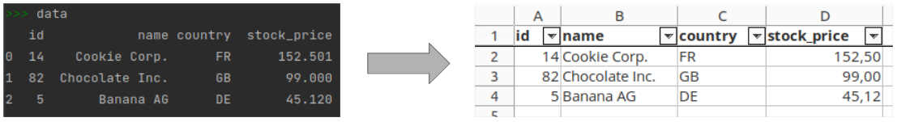
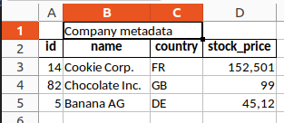
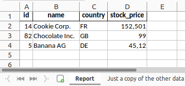
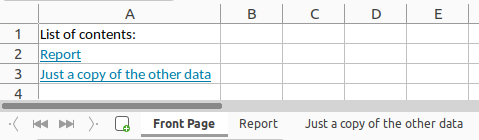

# python-excel-report
_Create pretty Excel reports with Python_



See also our [blog article](https://www.inwt-statistics.com/read-blog/automated-excel-reports-with-python.html)
about this topic.


## Basic usage

First make sure the following Python packages are installed:

- openpyxl
- pandas
- XlsxWriter

It's sufficient to adapt the `input_file_path` in the `CONFIG` object and then run the whole script.

## Configuration

You can configure the Excel file's appearance in the `CONFIG` object at the top of the script.
- `input_file_path`: path to a csv file with your data. 
  The data will be read from this path after the definition of the `CONFIG` object.
  If you want to load the data from any other file than a csv file, also adapt the code that loads the file.
- `output_file_name`: path where the Excel file will be saved
- `sheet_name`: name of the spreadsheet in the Excel file
- `column_header_format`: formatting options for the column names, e.g., font, font colour, and font size
- `text_format`: formatting options for the columns' content
- `column_widths`: widths of the columns in the Excel file.
  It's a dictionary where the keys are the column numbers (starting from 0)
  and the values are the respective width.
- `columns_2_decimal_places`: numbers in these columns are always displayed with two decimal places.


## Extensions

This section describes multiple possible extensions that are not in the script
for the sake of simplicity.

### Multiheaders

To add a multiheader that spans multiple columns,
the data must start in row 1 instead of 0, and you can use the `merge_range` method,
for example:

```python
import pandas as pd

data = pd.read_csv("input_data.csv")
writer = pd.ExcelWriter("excel_report.xlsx")
data.to_excel(writer, index=False, sheet_name="Report", startrow=1)
sheet_report = writer.sheets["Report"]
sheet_report.merge_range(first_row=0, last_row=0, first_col=1, last_col=2, data="Company metadata")
writer.save()
```



### Multiple sheets

This is how you can create multiple sheets in one file:

```python
import pandas as pd

data = pd.read_csv("input_data.csv")
data_2 = data.copy()
writer = pd.ExcelWriter("excel_report.xlsx")
data.to_excel(writer, index=False, sheet_name="Report")  # First sheet
data_2.to_excel(writer, index=False, sheet_name="Just a copy of the other data")  # Second sheet
writer.save()
```



### Table of content

You can add a first sheet with a table of contents and with links to the respective sheets.

```python
import pandas as pd

writer = pd.ExcelWriter("excel_report.xlsx")
workbook = writer.book

# Add table of contents for two sheets
front_link_dict = {"A2": "Report", "A3": "Just a copy of the other data"}
sheet_front_page = workbook.add_worksheet("Front Page")
sheet_front_page.write("A1", "List of contents:")
for column, sheet_name in front_link_dict.items():
    sheet_front_page.write_url(column, "internal:{}!A1:A1".format(sheet_name), string=sheet_name)

# Fill the two sheets
data = pd.read_csv("input_data.csv")
data_2 = data.copy()
data.to_excel(writer, index=False, sheet_name="Report")  # First sheet
data_2.to_excel(writer, index=False, sheet_name="Just a copy of the other data")  # Second sheet

writer.save()
```

